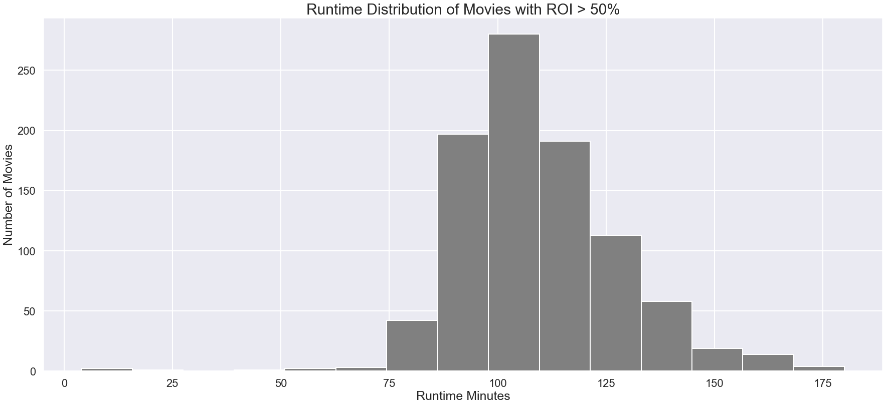
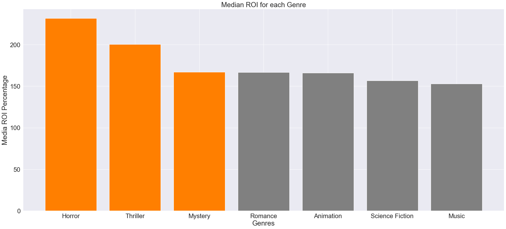
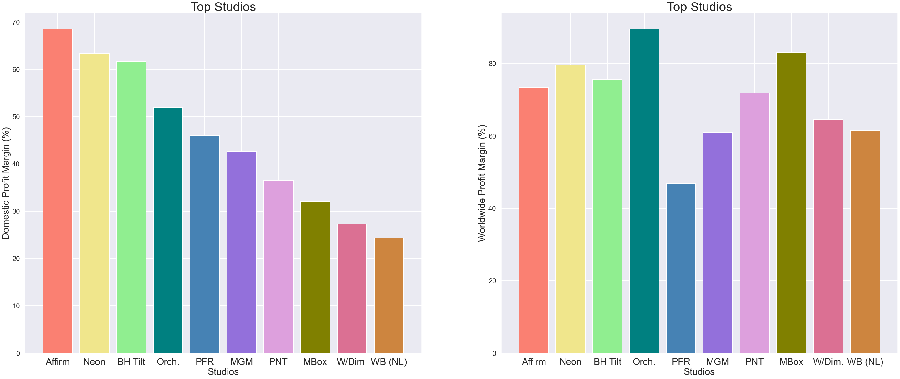
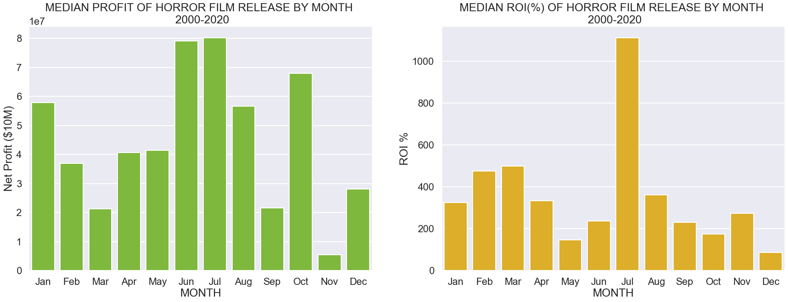

# Phase-1-Project-Movie-Data

# Microsoft Movie Studio Business Analysis

**Authors**: [Madoria Thomas](https://github.com/madoriathomas), [Gregory Han](https://github.com/gregoryhhan), [Nathaniel Martin](https://github.com/UpGoerFive), [Weston Shuken](https://github.com/westonshuken)

## Overview

Microsoft wants to launch a new movie studio.

By analyzing historical data, we uncovered data-driven tips for ensuring a the company's production is high performing with an efficient return on investment. We suggest ideas for genres, runtime, and studio acquisitions.

## Business Problem

Microsoft does not know anything about creating movies, yet they want to create a new movie studio. 

There are many unknown factors associated with how to make a profit.

* *How long should the films be?*
* *What genre should Microsoft produce?*
* *Should Microsoft start from scratch or acquire a studio?*

Using the data provided and additional resources, we devised a plan to answer these questions about how best Microsoft can break into the movie studio market and ensure profitability.

## Data Understanding

We are using movie datasets from 5 different sources:

* [IMDB](https://www.imdb.com/)
* [TheMovieDB](https://www.themoviedb.org/)
* [Box Office Mojo](https://www.boxofficemojo.com/)
* [The Numbers](https://www.the-numbers.com/)

The data includes information on movie genres, titles, runtime, production expense, foreign & domestic box office gross, production studio name, and release dates.

With these datasets, we will search for insights in box office performence and user ratings compared to various factors like genre, personel, runtime, production budget and release time.

## Methods

We analyzed hundreds of thousands of data records across multiple sources to conduct descriptive statistics and visualizations.

However, much of the data was irrelevant to our needs:

* Dating back to 1915
* $0 Box Office Gross (likely due to streaming only releases)
* Extremely low budget films 
* Missing entries

We cleaned, merged, and built data frames thay would best suit our analysis for a modern movie studio, interested in movie theater releases, and with a budget sufficient budget for major film productions.

## Analysis and Visualisations
We used descriptive analysis to discover trends in the data. We also looked at trends, frequencies and distributions to visualize our findings.

### Runtime Frequency 


### Mean ROI by Genre


### Median ROI by Genre


### Top Studios by Profit Margin


### Movie Profit by Month of Release (Horror Films)


### Profit Counts Worldwide


## Recommendations

This analysis leads to three recommendations for Microsoft when creating a movie studio:

1. **Don't make cliffhangers or movies too long.** Runtime for movies should be made between 90-120 minutes; movies with ROI above 50% were made in this range.
2. **Acquire Neon or Orchard Film Studios.** Both Neon and Orchard are ranked highly in profits for both domestic and worldwide markets. Acquiring either one of these two would allow Microsoft to make movies that are competitive in the box office.
3. **Create horror, mystery, or thriller movies.** Adding these genres as part of the production portfolio would garner Microsoft a higher return on investment.


## Next Steps

Further analyses could provide additional insights to having a more successful movie studio for Microsoft:

* **Net Profit to Studio Data.** As of now we are seeing the net profit of the film at box office but not what profits are returning directly to the studios involved. Having the net profit by film to studio would increase the strength of our analysis of when to release movies.
* **Other expense data.** Further inspection to types of expense could also help for your capital budgeting. E.g. marketing expense, distribution expense, etc.
* **Competitors' financial performance.** Deeper understanding of competitive landscape — to have organized data on competitors financial performance would help strengthen our M&A recommendations. E.g. historical market cap data
* **Straight to streaming and licensing.** Although the box office is important for new films, much the data had $0 box office gross which led us to believe some films sell straight to streaming licensing. Exploring data related to streaming and licensing would also provide a realistic prediction of how a film could be exploited.


## For More Information

Please review our full analysis in [our Jupyter Notebook](./Microsoft Movie Studio Business Analysis.ipynb) or our [presentation](./Movie_Data_Slides.pdf).

For any additional questions, please contact **[Madoria Thomas](https://www.linkedin.com/in/madoria-thomas-2b9637133/), [Gregory Han](https://www.linkedin.com/in/gregory-han-140b32114), [Nathaniel Martin](https://www.linkedin.com/in/nathaniel-martin-73b037227/) and [Weston Shuken](https://www.linkedin.com/in/weston-shuken/) — Collectively known as, 'The Four Forks'**

## Repository Structure

```
├── README.md                                         <- The top-level README for reviewers of this project
├── Movie_Recommendations.ipynb                       <- Narrative documentation of analysis in Jupyter notebook
├── Movie_Data_Slides.pdf                             <- PDF version of project presentation
├── data                                              <- Both sourced externally and generated from code
└── images                                            <- Both sourced externally and generated from code
